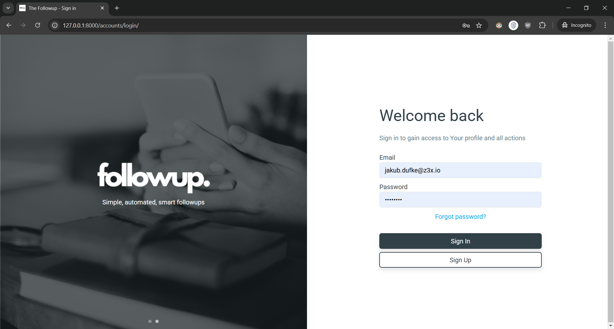
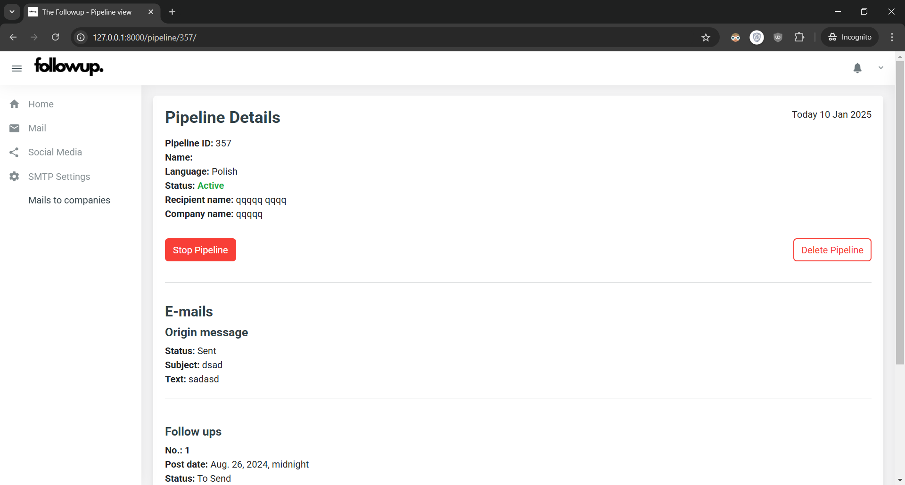
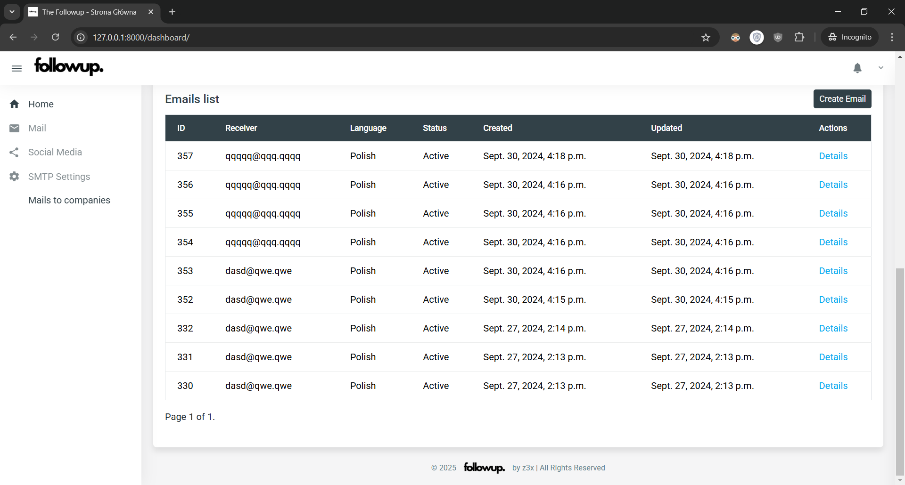
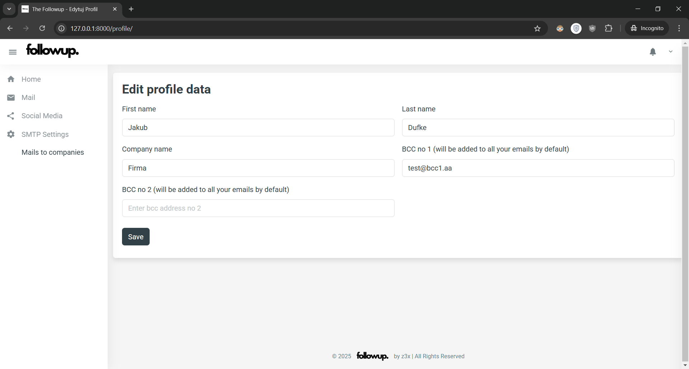

# TheFollowUp

## Overview

**TheFollowUp** is an application designed to automate social media posts and follow-up emails. By leveraging OpenAI's API, the app generates and refines posts based on original messages, then creates additional follow-ups that are sent automatically to users at scheduled times.

This project aims to streamline communication by automating repetitive tasks such as responding to emails and posting content on social media. The application uses dynamic scheduling, allowing users to activate and deactivate follow-ups as needed.

---

## Features

- **User Authentication**:  
  Users can create accounts, with email confirmation required to activate their accounts. The login process is secured, and users can reset their passwords if needed.

- **Admin Panel**:  
  The Django-based admin panel allows the management of user accounts, follow-up content, and system settings.

- **Follow-up Generation**:  
  The application utilizes OpenAI’s API to generate personalized follow-up emails and social media posts based on user input. These can be sent automatically at scheduled intervals.

- **Bulk Emailing**:  
  Allows users to generate and send follow-up emails to multiple recipients simultaneously.

- **Dynamic Follow-up Control**:  
  Users can start, stop, and modify follow-ups at any time from the user interface, giving them full control over their communication.

- **Stripe Integration for Premium Status**:  
  Users can upgrade to a premium account to create more than 5 follow-ups. A test webhook for Stripe is implemented to handle subscription-based upgrades.

- **Password Reset**:  
  Users can request a password reset via email, ensuring secure account access.

- **Account Settings**:  
  Users can manage their accounts, including email integration, where Zenbox is supported for sending emails. For Gmail integration, users need to enable two-step verification and generate an app-specific password.

- **Responsive Design**:  
  The application features a responsive, side-expandable menu, ensuring a seamless experience on both desktop and mobile devices.

- **Automated Email Sending**:  
  A background script sends follow-up emails automatically, without user intervention, according to the schedule defined in the user’s settings.

- **Dashboard**:  
  The dashboard displays a list of generated follow-ups and provides preview details of the emails or social media posts.

---

## Tech Stack

- **Backend**: Django (Python)
- **Frontend**: HTML, CSS, JavaScript
- **Database**: SQL (pgAdmin)
- **External APIs**: OpenAI API (for content generation), Stripe (for premium account processing)

---

## My Contribution

I was responsible for developing the **backend** of the application, which included:
- Implementing Django models and views to manage user accounts, emails, and follow-up data.
- Integrating OpenAI API for generating content based on user input.
- Setting up email services using Zenbox and configuring Stripe for premium status management.
- Assisting with frontend HTML to create a working user interface, focusing on backend integration.

---

## Screenshots

The following screenshots demonstrate some of the core features of the application:

- **Login Screen**  
  
  
- **Follow-up Details**  
  
  
- **Dashboard with List of Generated Emails**  
  
  
- **Account Settings**  
  

---
